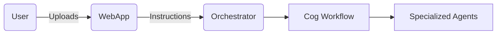

# AgentForge Chatbot Workflow SRS

## Overview
This document describes a proposed web-based workflow for AgentForge that allows users to upload source files and provide text instructions for autonomous agent processing.

## Goals
- Provide a simple web interface with a text box and document upload field.
- Deploy specialized agents orchestrated by an `Orchestrator` to process instructions and uploaded content.
- Support containerized deployment with optional open‑source LLM back ends such as Ollama.
- Integrate with GitHub and GitLab for repository automation.

## Functional Requirements
1. **Web Front End**
   - A chat interface that accepts text instructions.
   - Upload control for multiple files (code, documents).
   - Chat history display.
2. **Agent Orchestration**
   - `SpecializedAgent` classes for domain expertise.
   - `Orchestrator` coordinates agents and aggregates results.
   - Minimal manual confirmation for autonomous runs.
3. **Repository Integration**
   - Link to GitHub/GitLab using personal access tokens.
   - Agents clone repositories and push changes automatically when permitted.
4. **Deployment**
   - Containerization via Docker.
   - `webapp` served via Gunicorn or a similar server.

## Non‑Functional Requirements
- Open source licensing.
- Designed for self‑deployment on any container platform.
- Minimal external dependencies beyond those in `REQUIREMENTS.txt` plus Flask.

## Tasks and Microgoals
| Task | Microgoal | Completion Criteria |
|------|-----------|--------------------|
|Implement Orchestrator|Basic class that runs multiple agents|Unit test imports and run function return results|
|Provide Web App|Flask app with upload and text field|Route returns HTTP 200 in tests|
|Container Setup|Dockerfile to build and run webapp|`docker build` completes locally|
|CI Integration|Placeholder test for GitHub integration|Unit test ensures functions import|
|Documentation|This SRS and future architecture docs|SRS file committed|

## System Diagram

Additional diagrams can be expanded in future revisions.
